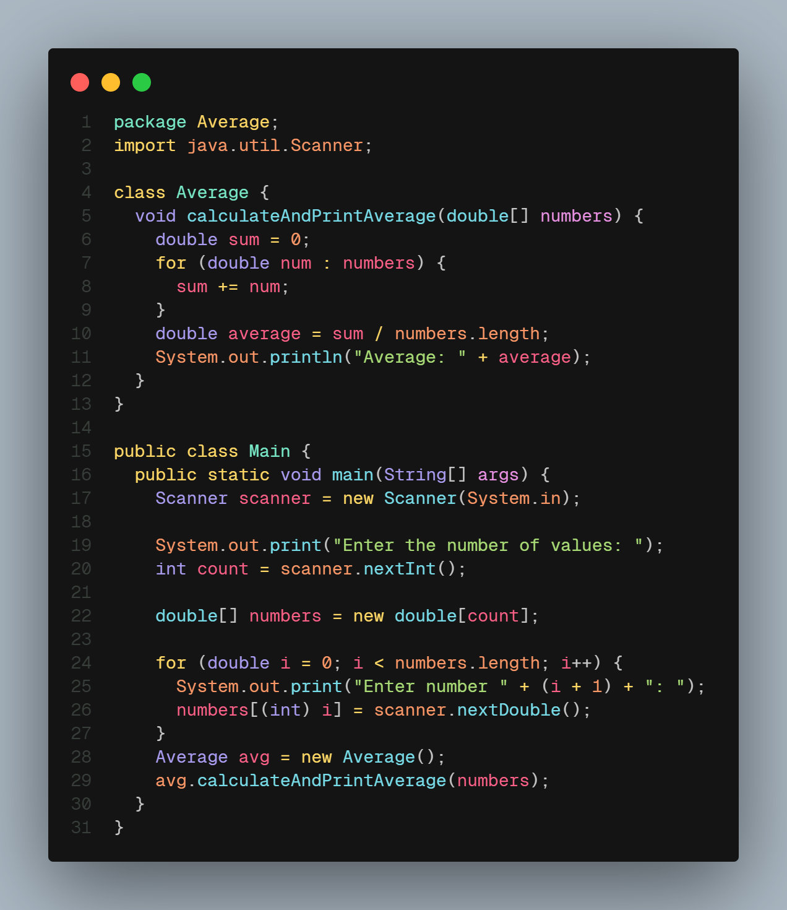
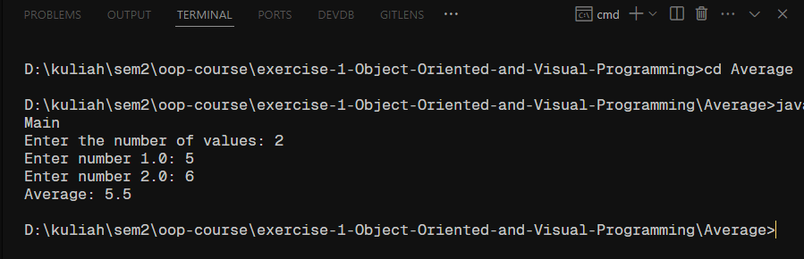
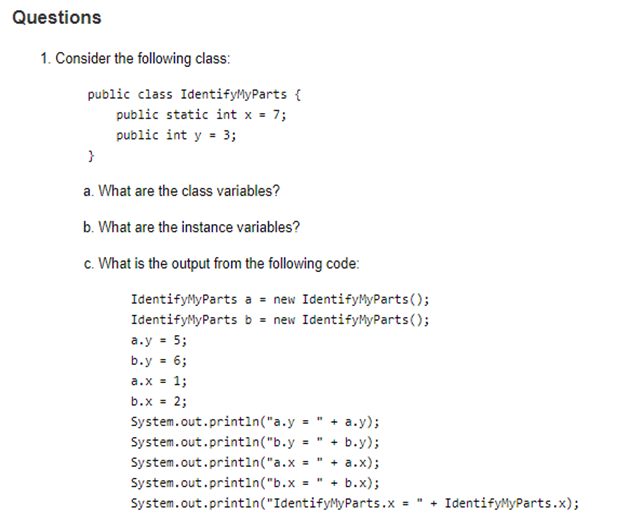
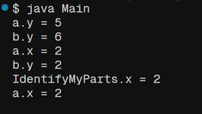
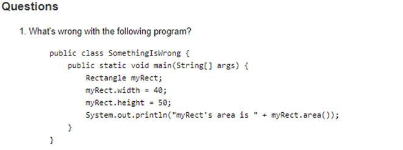

# Exercise 1

## 1. Print the average of three numbers entered by user by creating a class named `Average` having a method to calculate and print the average.

## Code

## Result

### 2.

### a. What are the class variable?

**Answer:** x (declared with static, meaning only one copy exists that belongs to the class. The value of ‘x’ is same for all objects)

### b. What are the instance variables?

**Answer:** y

### c. What is the output from the following code?

**Answer:**  

## 3.

**Answer**

-   The class Rectangle is missing.
-   Object “Rectangle myRect;” is declared but not initialized.
-   Trying to access “width” and “height” without initializing “myRect” will cause a NullPointerException.
